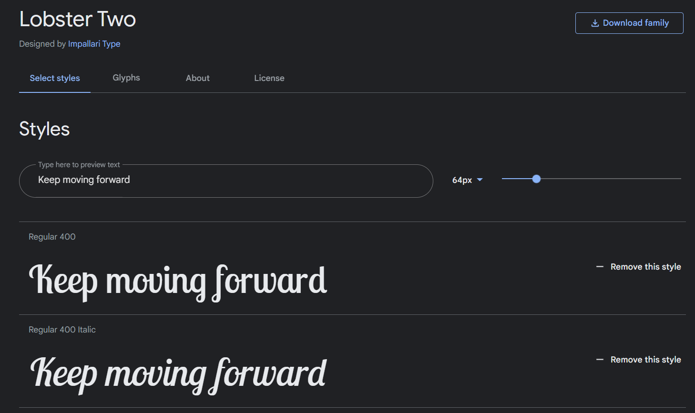
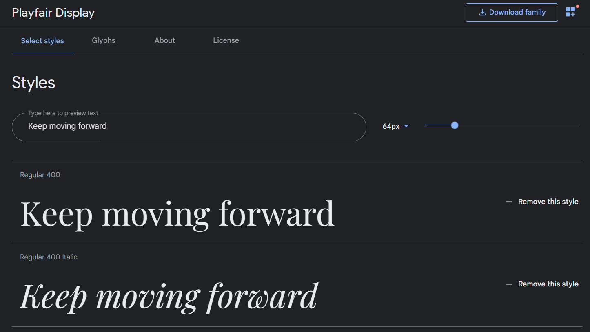
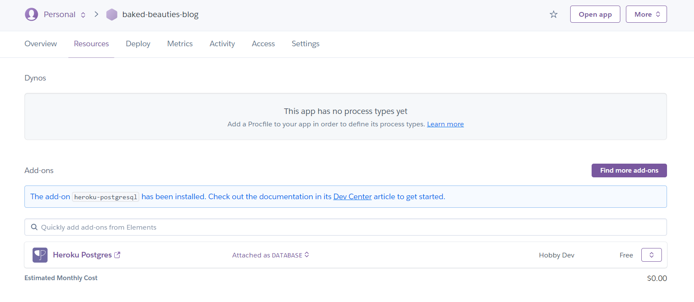

# Baked Beauties

'Baked Beauties' is a blog about baked, mouth-watering goodies. It aims to induce hunger and captivate foodies who enjoy freshly-baked, delicious cakes, muffins, and the like but will also actually provide recipes for people to try. The site will be targeted toward people who have an interest in or are curious about baking.

<!-- TODO: -->

## Requirements

<!--TODO-->

## Design

### Wireframes

<!--TODO-->

### Typography

Google Fonts was used to find and select fonts for the site's typography.

'[Lobster Two](https://fonts.google.com/specimen/Lobster+Two)' is used for headings and the navigation bar and footer text.
'[Playfair Display](https://fonts.google.com/specimen/Playfair+Display)' is used for all other text.

### Colours

The site's colour scheme was chosen using the Adobe Color scheme extraction tool and a random image found from a Google search for 'cupcake'.

### Coding practices

To ensure that the project code is up to standard, the following PEP rules were adhered to:

* [PEP 8 -- Style Guide for Python Code](https://www.python.org/dev/peps/pep-0008/) - for best code style practices (i.e. layout, naming conventions, comments, etc.) and programming recommendations on function and variable annotations
* [PEP 257 -- Docstring Conventions](https://www.python.org/dev/peps/pep-0257/) - for general rules on docstrings
* [NumPy Style Guide](https://numpydoc.readthedocs.io/en/latest/format.html) - for a more detailed explanation of what goes where in docstrings, using [this](https://sphinxcontrib-napoleon.readthedocs.io/en/latest/example_numpy.html) specifically as an example to follow
* [PEP 3107 -- Function Annotations](https://www.python.org/dev/peps/pep-3107/) - for a specific way to specify function information and avoid confusion
* [PEP 484 -- Type Hints](https://www.python.org/dev/peps/pep-3107/) - also for purposes of clarity (although provisional)
* [PEP 526 -- Syntax for Variable Annotations](https://www.python.org/dev/peps/pep-0526/) - also for purposes of clarity

### Planning and execution

Agile practices were used to carry out this project and documented in Trello [planning/design board](https://trello.com/b/i7BTn4iC/project-planning-design) and [dev board](https://trello.com/b/wsBEYfJM/project-development) and [Github Projects](https://github.com/DebzDK/baked-beauties-blog/projects/1).

*Please note that more task details + resources are available in the Trello boards than in the Github Projects page.*

Each board is divided into 3 swimlanes/columns:
* 'To Do' - used to list tasks that are yet to be done
* 'In Progress' - used to list tasks that are currently being carried out
* 'Done' - used to list completed tasks

After defining the status divisions for a task, the indicators for time constraints were defined using 't-shirt sizes'.

‘T-shirt sizes’ were defined to provide an estimate for the perceived difficulty of a task and extra labels to further separate tasks by what part of the process they’re related to, i.e. Requirements, Design, Development, and Testing.
The project area labels have been defined as follows:
* ‘Requirements’ - refers to things that are directly taken from or related to the project’s assessment criteria rather than actions derived from a requirements capture process
* 'Design' - refers to steps taken towards the appearance of the website
* 'Development' - refers to steps taken towards the implementation of the website
* 'Testing' - refers to steps taken towards validating the HTML and CSS as well as testing the responsiveness of the website

At this point, user stories were created in order to produce tasks while thinking from a user's perspective.

All other user stories follow the same kind of format except for where the user story is self-explanatory of the task.

## Features

Each feature listed below was chosen to provide users with a clear, logical path through the application content in order for this project to achieve its goal and its functional requirements.

### Existing features

<!--TODO-->

### Future features

* Ability for users to reply to each other's comments on a blog post

    It would be nice if users were able to reply to each other within a nested thread of conversation.

* Ability for users to instant message one another

    This would be a nice way to promote a sense of community by allowing users to communicate with each other whenever they wanted and also to share their own recipes.

* Ability to send out an email to let users know when there's a new blogpost

    This would have been a cool feature to implement to make it feel more like a real blog site.

## Languages and technologies used

* Languages
    * [Python](https://en.wikipedia.org/wiki/Python_(programming_language)) - used to create the command line application
    * [CSS3](https://en.wikipedia.org/wiki/CSS) - used Cascading Style Sheets to style HTML
    * [Bootstrap](https://getbootstrap.com/) - used for responsive design
    * [JavaScript](https://en.wikipedia.org/wiki/JavaScript) - used to make webpages interactive
    * [jQuery](https://jquery.com/) - used for easy document tranversal and manipulation

* Technologies
    * [Adobe Color](https://color.adobe.com/) - used to create colour scheme for website
    * [Autoprefixer](https://autoprefixer.github.io/) - used to automatically add vendor prefixes for browser compatibility
    * [CompressJPEG](https://compressjpeg.com/) - used to compress all website images
    * [EZGIF](https://ezgif.com/) - used to create the GIFs used in this README
    * [Pexels](https://www.pexels.com/) - used to find free licence images
    * [Django](https://www.djangoproject.com/) - used to build web app
    * [PostgresSQL](https://www.postgresql.org/) - used to store relational data
    * [Heroku](https://www.heroku.com/) - used to deploy project
    * [Git](https://git-scm.com/) - used for version control
    * [GitHub](https://github.com/) - used for internet hosting and version control through use of Git
    * [Gitpod](https://gitpod.io/) - used as online IDE for software development
        * The terminal was used to create branchs to work on before merging into the main branch. These branches have been preserved for the sake of the assessment, otherwise they would have been deleted after use.

        <!--TODO: -->

#### Shortcomings

## Testing

Evidence for this section has been placed in its own .md file which can be found [here](https://github.com/DebzDK/baked-beauties-blog/blob/main/TESTING.md).

## Deployment

The application was deployed via [Heroku](https://www.heroku.com/) using the steps listed below:

1. In Heroku, click 'New' then 'Create app'.

    

1. Name the app and select your closest region.

    

1. Add Postgres add-on.

    

1. Set up configuration variables.

    

1. Due to an issue with Heroku and GitHub at the time of deployment, Heroku CLI was using instead of automatic deployments.

    *Note: Automatic deployments were not enabled for this project.*

    
    

The live link can be found here - https://baked-beauties-blog.herokuapp.com/

### Local deployment

Since my work is in a publicly-accesible repository, it can be copied in 3 different ways:

1. Cloning the repository

    <code>git clone https://github.com/DebzDK/baked-beauties-blog.git</code>

1. Forking the repository

    

1. Using Gitpod to create a new workspace for the repository with this button: 

## Credits

### Content

All textual content on the site is written in my own words and of my own opinion.

### Media

All images were compressed using [Compress JPEG](https://compressjpeg.com/).

Purpose | Credit | Source
------------ | ------------- | -------------
Logo | [Freepik](https://www.flaticon.com/authors/freepik) | [Flat icon](https://www.flaticon.com/premium-icon/muffin_1050269?term=baking&related_id=1050269)

## Acknowledgements

Thanks to my mentor [Tim Nelson](https://github.com/TravelTimN) for encouraging me to center my projects around my interests!